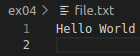
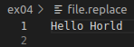
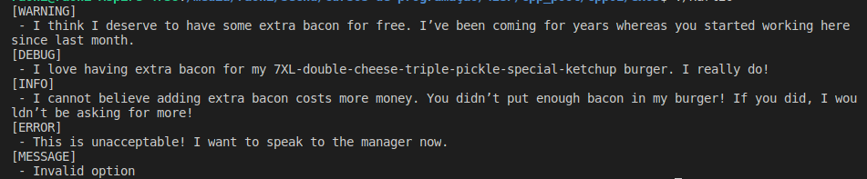

# CPP Pool 01/08

Second list in CPP Pool where we dive for the first time in a new C++ and POO 

## About

This project utilize C++ library and Makefile only.

## Installation

```
git clone https://github.com/LacrouxRaoni/cpp01.git
```

in a folder you want; 

then go tothe exercice folder and type make.

run ```./projectName``` and it's done!<br><br><br>

## Exercise 00 - BraiiiiiiinnnzzzZ

to run type:

```
./BraiiiiiiinnnzzzZ
```

This exercise has one class name Zombie which receive a String with Zombie name. 

The newZombie.cpp alloc memory in heap while randomChump.cpp alloc memory in the stack and the Zombie class  shouts a message. After that, the destructor frees the heap memory and the program ends.<br><br>


## Exercise 01 - Moar Brainz!

to run type:
```
./MoarBrainz!
```

The goal of this exercise is created a horde of zombies using an Object[size N] allocated in the heap in function zombieHorde. 

Each Zombie when it created it's announced by an output message. At the end of the execution all the horde is deleted from memory.<br><br>


## Exercise 02 - HI THIS IS BRAIN

to run type:
```
./HI_THIS_IS_BRAIN
```

The goal of this exercise is simply create a string, a pointer to this string and a reference to it. 
Show the memory value in the terminal and the Data in each variable.<br><br>

## Exercise 03 - Unnecessary violence

to run type:
```
./UnnecessaryViolence
```

This exercise is necessary create a class with name Weapon with getter and setter. Two other classes with name HumanA with Weapon class as referece and HumanB with Weapon class as a pointer. Also, both classes have custom constructors. 

There are two tests in main.cpp where the Human A and HumanB get the weapon to attack, by with two different ways. It's necessary understand how reference and pointer works on both classes so the tests can run accordantly.<br><br>

## Exercise 04 - Sed is for losers

to run type:
```
./SedIsForLosers "file_name" "string1" "string2"
```

The exercise 04 receives a file, string1 and string2 as arguments. If the user try to send something diffrent from it. The application won't work.

It's necessary create a program that's received a file. Read the info in this file. Check if there is some ocurrency of string1, replace it for string2 and save the info in a new file (file_name.replace). 

Eg: If the user sends as below:<br>


-cmd line:


-file:<br>



The program search the argument "W" in file, replace by "H" and save in the "file.replace" as below:

-new_file:<br>

<br><br>


## Exercise 05 - Harl 2.0

to run type:
```
./Harl20
```
Harl is a log level system who complain about insignificant things accordantly with the level message. 

In this exercise it's necessary learn about pointer functions and how to call it only by the method name with no args or parentheses, also ifs and elses are not allowed. So we need to find another solution to build the algorithym. The main file is calling all the possible message levels so the system can display it in terminal. 


<br><br>

## Exercise 06 - Harl Filter

Similar with exercise 05. Now the args should come from the terminal and Harl must print all the info from same level and higher priority. Also, this exercise must be written using switch function.
